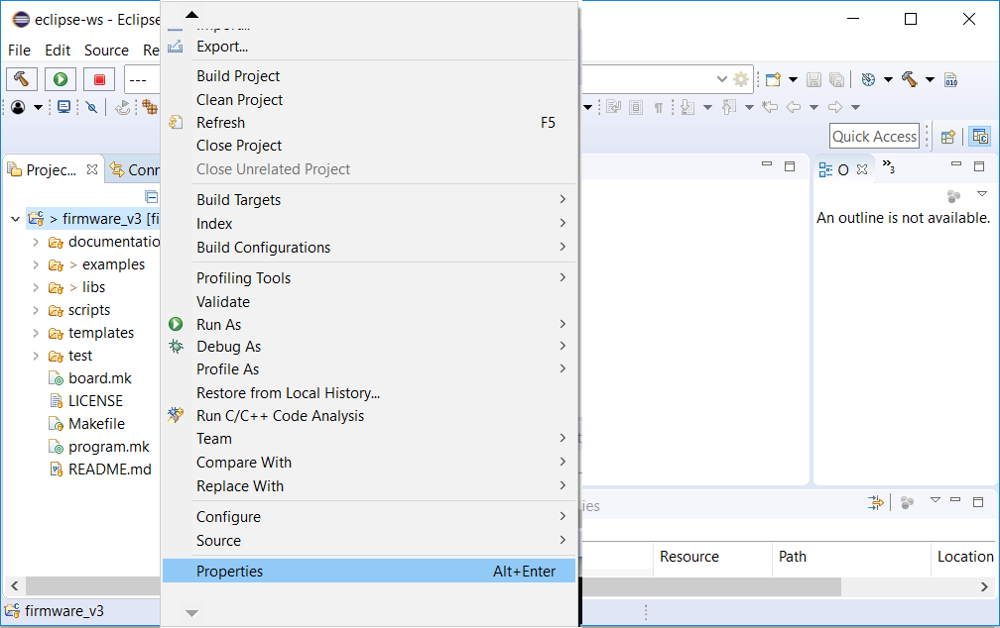
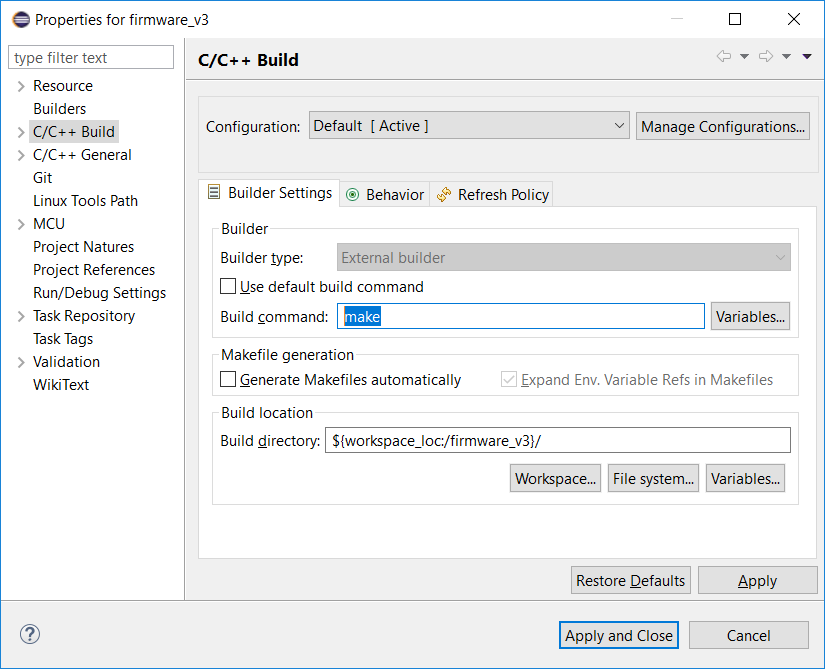

## Índice


# Compilar proyecto firmware_v3 en Eclipse

## 1. Configurar opciones de compilación

Se debe hacer click derecho sobre el proyecto "firmware_v3" y luego en la opción "*Properties*":



En la ventana que se abre debe hacer click sobre "*C/C++ Build*" y en la parte derecha debe:

- Destildar la opción "*Use default build command*".
- En "*Build command*" escribir ```make``` en el campo de texto.

Presionar *"Apply and Close*" para aplicar la configuración.



## 2. Compilar proyecto

Para compilar el proyecto puede realizarlo mediante el icono del martillo (*Build*), o mediante la opción "*Build*" presionando el botón derecho sobre el proyecto firmware_v3.


**Nota**: firmware_v3 compilará el programa que tenga seleccionado para compilar, si es la primera vez compilará el ejemplo seleccionado por defecto.

Al presionar "*build*" se compila el proyecto dando como resultado lo siguiente:


**Nota:** observe que se ve: 

- Los bytes ocupados en cada área de memoria (ver apunte de printf() y scanf() para comprenderlo).
- El programa que fue compilado dentro del proyecto, en este caso llamado "app" en la carpeta "examples/c" dentro de "firmware_v3".
- La plataforma de hardware para la cual se compiló el programa, en este caso "EDU-CIAA-NXP".


## Más información

- [Depuración de un programa sobre la plataforma de hardware con Eclipse](../debug/debug-es.md).
- [Volver al README](../../../readme/readme-es.md).
