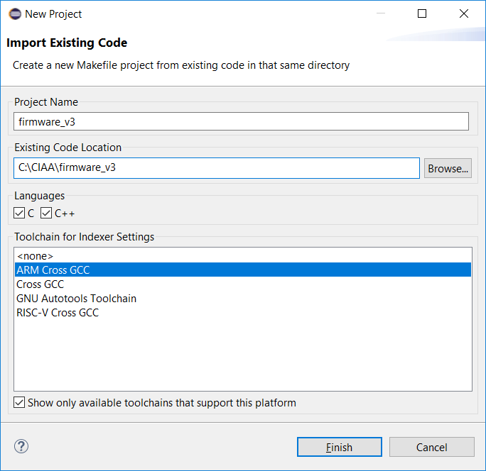
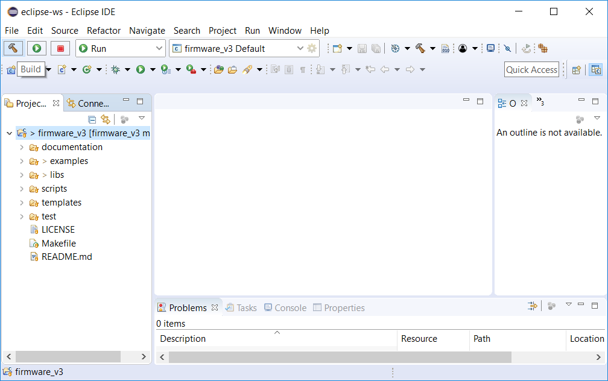
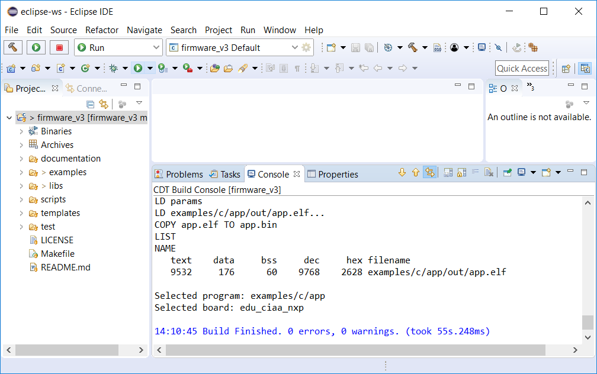
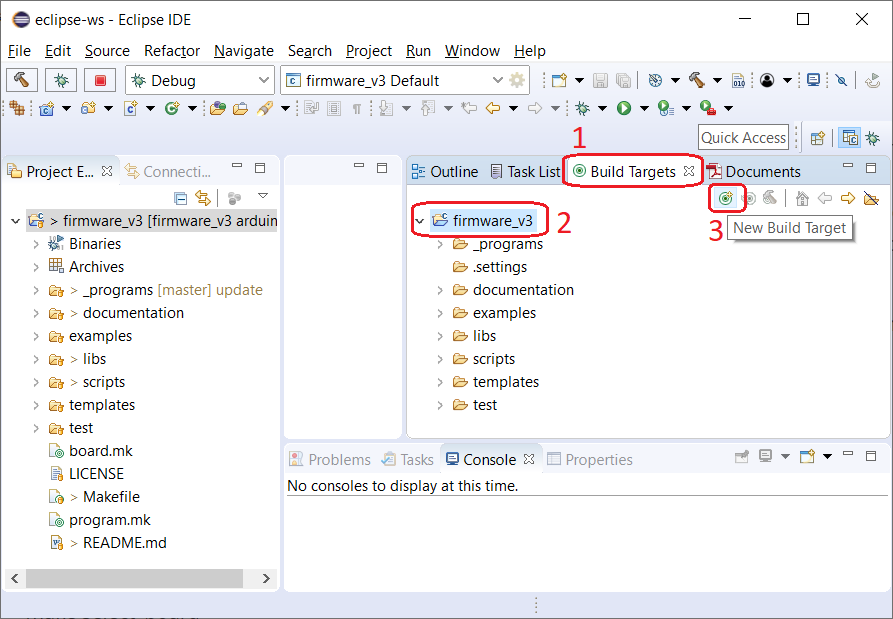
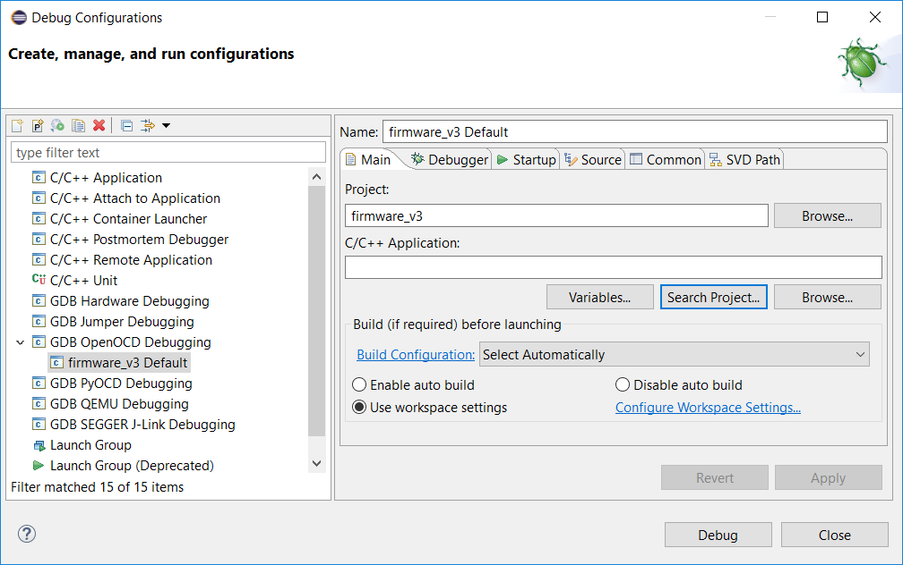
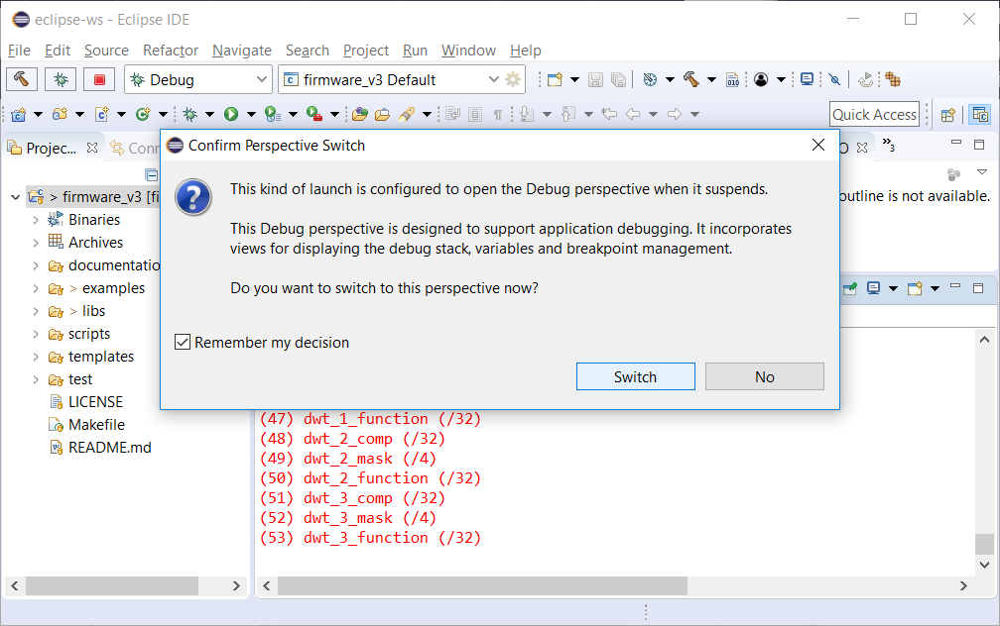
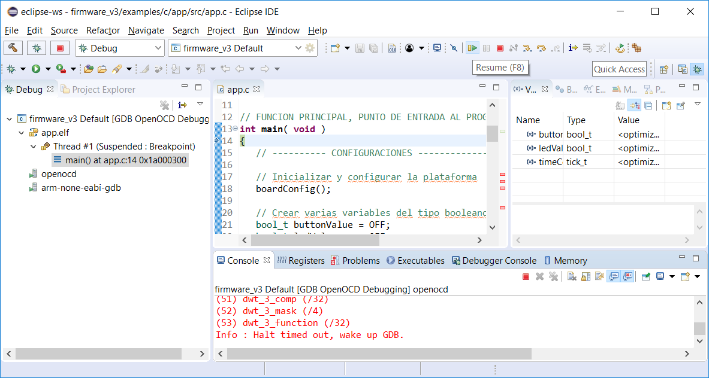

## Índice

<div>
<ul style="list-style:none;">
   <li><a style="text-decoration: none;" href="#utilización-de-firmware_v3-con-eclipse">Utilización de firmware_v3 con Eclipse</a></li>
   <ul style="list-style:none;">
      <li><a style="text-decoration: none;" href="">1.1. Abrir proyecto firmware_v3 en Eclipse por primera vez</a></li>
      <ul style="list-style:none;">
         <li><a style="text-decoration: none;" href="">1.1.1. Iniciar Eclipse</a></li>
         <li><a style="text-decoration: none;" href="">1.1.2. Workspace</a></li>
         <li><a style="text-decoration: none;" href="">1.1.3. Ventana inicial</a></li>
         <li><a style="text-decoration: none;" href="">1.1.4. Abrir Proyecto de Firmware para programar en asembler, C o C++</a></li>
      </ul>
      <li><a style="text-decoration: none;" href="">1.2. Abrir proyecto firmware_v3 en Eclipse en sucesivas ocasiones</a></li>
   </ul>
   <li><a style="text-decoration: none;" href="">2. Compilar proyecto firmware_v3 en Eclipse</a></li>
   <ul style="list-style:none;">
      <li><a style="text-decoration: none;" href="">2.1. Configurar opciones de compilación</a></li>
      <li><a style="text-decoration: none;" href="">2.2. Compilar proyecto</a></li>
   </ul>
   <li><a style="text-decoration: none;" href="">3. Configurar y ejecutar <em>targets</em> de <em>makefile</em> en Eclipse</a></li>
   <ul style="list-style:none;">
      <li><a style="text-decoration: none;" href="">3.1. Targets por defecto en Eclipse</a></li>
      <li><a style="text-decoration: none;" href="">3.2. Configurar <em>targets</em> de <em>makefile</em> en Eclipse</a></li>
   </ul>
   <li><a style="text-decoration: none;" href="">4. Depuración de un programa sobre la plataforma de hardware con Eclipse y firmware_v3</a></li>
   <ul style="list-style:none;">
      <li><a style="text-decoration: none;" href="">4.1. Configuración de la descarga y depuración del programa sobre el hardware</a></li>
      <li><a style="text-decoration: none;" href="">4.2. Probar el funcionamiento de la depuración sobre el hardware</a></li>
      <li><a style="text-decoration: none;" href="">4.3. Botones de control de ejecución y breakpoints</a></li>
      <li><a style="text-decoration: none;" href="">4.4. Depurar otro programa dentro del mismo proyecto</a></li>
   </ul>
</ul>
</div>

# Utilización de firmware_v3 con Eclipse

## 1. Abrir proyecto firmware_v3 en Eclipse

### 1.1. Abrir proyecto firmware_v3 en Eclipse por primera vez

#### 1.1.1. Iniciar Eclipse

Recordar iniciar Eclipse desde el Launcher. Esto traerá las variables de entorno necesarias para ubicar las herramientas externas para compilación y depuración.

#### 1.1.2. Workspace

Al abrir el Eclipse solicita seleccionar la carpeta a utilizar como espacio de trabajo (*Workspace*), elegir dentro de la ruta donde descomprimieron el Launcher la carpeta:

```
<rutaDondeDescomprimiElLauncher>/workspaces/eclipse-ws
```


#### 1.1.3. Ventana inicial

Al iniciar el Eclipse muestra una pestaña de bienvenida (*Wellcome*) como la siguiente:


Debe cerrar esta pestaña para que se muestre el árbol de proyectos y el espacio del editor de archivos:


#### 1.1.4. Abrir Proyecto de Firmware para programar en asembler, C o C++

Primero debemos clonar o descargar el Proyecto a abrir, en este caso firmware_v3:

https://github.com/epernia/firmware_v3

Ubicar la carpeta Firmware v3 dentro de la carpeta del Launcher. 

Luego en Eclipse ir al menú:

```
New --> Makefile Project with Existing Code
```


En la ventana que se abre deberá:

- Elegir mediante "Browse" la carpeta ```firmware_v3```
- Tildar en Languages ```C``` y ```C++```
- Elegir como Toolchain ```ARM Cross GCC```



Una vez realizado presione "Finish" y verá el Proyecto "firmware_v3" en el árbol de proyectos:


Con esto queda el proyecto firmware_v3 listo para su utilización. 

**Nota**: Eclipse puede tener múltiples proyectos en simultáneo dentro de un mismo *Workspace*. En particular, el proyecto *firmware_v3 es un único proyecto que se compone de múltiples programas* (los ejemplos que trae más los programas que realizaremos nosotros). Es decir con un único proyecto de Eclipse abierto tendremos la posibilidad de seleccionar que programa del mismo se desea compilar y descargar a la plataforma de hardware.

### 1.2. Abrir proyecto firmware_v3 en Eclipse en sucesivas ocasiones

Eclipse guarda todas las configuraciones realizadas sobre la carpeta elegida como *Workspace* con y de esta manera al abrir nuevamente Eclipse y seleccionar el *Workspace* que hemos creado se cargará el proyecto firmware_v3 automáticamente.

## 2. Compilar proyecto firmware_v3 en Eclipse

### 2.1. Configurar opciones de compilación

Se debe hacer click derecho sobre el proyecto "firmware_v3" y luego en la opción "*Properties*":


En la ventana que se abre debe hacer click sobre "*C/C++ Build*" y en la parte derecha debe:

- Destildar la opción "*Use default build command*".
- En "*Build command*" escribir ```make``` en el campo de texto.

Presionar *"Apply and Close*" para aplicar la configuración.


### 2.2. Compilar proyecto

Para compilar el proyecto puede realizarlo mediante el icono del martillo (*Build*), o mediante la opción "*Build*" presionando el botón derecho sobre el proyecto firmware_v3.



**Nota**: firmware_v3 compilará el programa que tenga seleccionado para compilar, si es la primera vez compilará el ejemplo seleccionado por defecto.

Al presionar "*build*" se compila el proyecto dando como resultado lo siguiente:



**Nota:** observe que se ve: 

- Los bytes ocupados en cada área de memoria (ver apunte de printf() y scanf() para comprenderlo).
- El programa que fue compilado dentro del proyecto, en este caso llamado "app" en la carpeta "examples/c" dentro de "firmware_v3".
- La plataforma de hardware para la cual se compiló el programa, en este caso "EDU-CIAA-NXP".

## 3. Configurar y ejecutar *targets* de de *makefile* en Eclipse

### 3.1. Targets por defecto en Eclipse

Eclipse muestra algunos de sus *targets* de diferentes maneras:

- El *target* **all** como el "botón del martillo" (***Build project***) accesible desde el menú superior.

  

El botón ***build*** ejecuta el comando:

`make all` 

- Si se presiona botón derecho del *mouse* sobre el proyecto firmware_v3 se muestran como opciones del menú contextual:

  - ***Build Project.*** Ejecuta el comando `make all` 
  - ***Clean Project.*** Ejecuta el comando `make clean` 

  

- Además se pueden configurar y agregar *targets* adicionales como se explica en la siguiente sección.

### 3.2. Configurar *targets* de de *makefile* en Eclipse

Para agregar botones para ejecutar *targets* de de *makefile* en Eclipse se debe ir a la pestaña ***Build Targets*** (1), luego presionar en la carpeta ***firmware_v3*** (2) y luego presionar el botón ***New Build Target*** (3):



De esta forma se abre un formulario donde se agrega el nuevo target. Por ejemplo, para agregar el *target download*:


De esta forma el target queda accesible como un botón en eclipse como se muestra a continuación:


Se recomienda agregar los *targets*:

- `all` Compilar programa seleccionado.
- `clean` Eliminar archivos de compilaciones previas (remueve la carpeta *out* dentro del programa seleccionado). Es necesario ejecutarlo sobre le programa seleccionado al cambiar opciones de compilación del programa (archivo *config.mk*) o al cambiar la plataforma de hardware (*board*) para la cual se compilará el programa.
- `clean_all` Eliminar archivos de compilaciones previas de todos los programas dentro de la carpeta firmware_v3.
- `download` Descarga el programa seleccionado a la *board* seleccionada.
- `erase` Borra la flash de la *board* seleccionada. Es necesario resetear la plataforma luego de aplicarlo.
- `new_program` Permite gráficamente crear un nuevo programa dentro de la carpeta seleccionada por el usuario (la primera vez se pide el nombre de la carpeta donde se guardaran los programas y se crea dentro de la carpeta firmware_v3).
- `select_board` Permite elegir gráficamente la plataforma de hardware (*board*) para la cual se compilará el programa.
- `select_program` Permite elegir gráficamente el programa a utilizar (compilar, descargar, limpiar, etc.).

Se ejecutan realizando doble doble click sobre el icono de los mismos.

## 4. Depuración de un programa sobre la plataforma de hardware con Eclipse y firmware_v3

### 4.1. Configuración de la descarga y depuración del programa sobre el hardware

Ubique el ícono del bicho verde (*debug*) , presione sobre la flecha hacia abajo a la derecha de este icono y en la ventana que se despliega la opción "*Debug Configurations...*"


Esto abre la ventana de configuraciones:


A la izquierda realizar doble click sobre "*GDB OpenOCD Debugging*" que crea una nueva configuración:



En esta ventana se puede ver que proyecto está seleccionado (en este caso ```firmware_v3```) y el programa a descargar/depurar (campo de texto C/C++ Application:). 

Mediante el botón "*Search Project..*" puede elegir que programa va a descargar/depurar. 

**Nota**: recuerde que debe haber compilado previamente un programa. En este caso se muestra como ejemplo el programa ```app.elf```:


Seleccionarlo y presionar "*Ok*".


Ir a la pestaña "Debugger" donde deberá completar lo siguiente:

- Executable path: ```${OPENOCD_PATH}/openocd```
- Config options: ```-f scripts/openocd/lpc4337.cfg```


Deslice la pantalla más abajo y configure en la sección "*GDB Client Setup*":

- Executable name: ```arm-none-eabi-gdb```


Con esto ya se encuentra configurado el Eclipse para depurar. 

### 4.2. Probar el funcionamiento de la depuración sobre el hardware

Para probarlo presione sobre el botón "*Debug*". Aparecerá un mensaje como el siguiente la primera vez que avisa que el Eclipse pasará de la perspectiva de programación, a la de depuración (esto hace que se reacomoden vairos menues para facilitar la depuración). Presione "*Remember my decision*" y "*Switch*" para que no la muestre cada vez:



Cuando el programa se descargó a la plataforma y empezó a ejecutarlo dentendrá su ejecución al inicio de la función main().



### 4.3. Botones de control de ejecución y breakpoints

Mediante los botones de control de ejecución y breakpoints podremos controlar el programa que se ejecuta en la placa desde nuestra PC:


De izquierda a derecha:

- **Skip All Breakpoints (Ctrl+Alt+B)**. Habilitar/Deshabilitar breakpoints.
- **Resume (F8)**. Correr el código hasta el próximo breakpoint o de forma continua.
- **Suspend**. Detener la ejecución del programa.
- **Terminate (Ctrl+F2)**. Terminar sesión de debug con botón stop.
- **Connect/Disconnect**. Botón conectar o desconectar (siempre deshabilitado, no se utiliza en firmware_v3).
- **Step Into (F5)**. Ejecuta un paso dentro de la próxima función llamada.
- **Step Over (F6)**. Ejecuta un paso en una instrucción del código.
- **Step Return (F7)**. Ejecuta un paso fuera de la función actual. 

Además se puede *agregar o eliminar un breakpoint* mediante doble click en el área gris a la izquierda de las líneas de código).

En este ejemplo se puso un *beakpoint* en la función ```boardConfig()```:


### 4.4. Depurar otro programa dentro del mismo proyecto

Simplemente deberá compilar el otro programa y luego abrir la ventana "*Debug Configurations*" y mediante el botón "*Search Project..*" puede elegir que programa va a descargar/depurar:


**NOTA:**  Recuerde que previamente debe haber compilado el programa a depurar para que aparezca en la búsqueda.

Luego simplemente presionar sobre debug, el resto de las configuraciones que realizamos se hace una única vez.


## Más información

[Volver al README](../../readme/readme-es.md).

